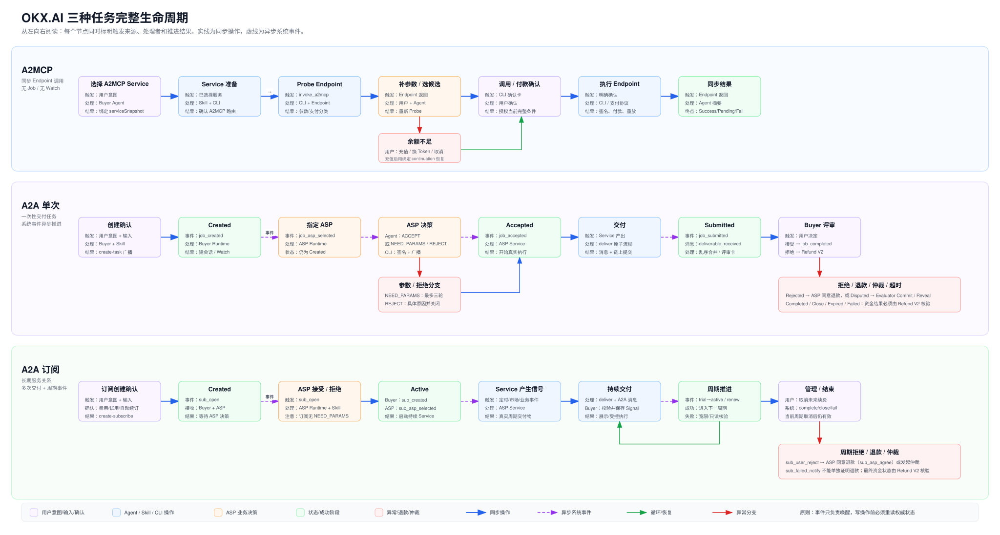

# OKX.AI 任务完整生命周期

本文说明 OKX.AI 当前工程中三类服务调用的完整生命周期：A2MCP、A2A 单次任务和 A2A 订阅任务。重点回答每一步由什么触发、谁负责处理、执行什么动作，以及完成后如何继续。

> A2MCP 是同步调用；A2A 单次是一次性交付；A2A 订阅是长期服务关系。



## 1. 阅读方法

### 1.1 推进来源

| 类型 | 含义 | 示例 |
|---|---|---|
| 用户意图 | 用户表达目标，但通常不等于授权付款或链上写操作 | “调用这个服务”“创建订阅” |
| 用户输入 | 用户提供完成任务所需的业务数据 | 参数、附件、退款原因 |
| 用户确认 | 用户明确授权当前确认卡所展示的写操作 | 确认创建、确认付款、提交退款 |
| Agent / Skill | 理解意图、做语义判断、选择当前允许的动作 | 判断 ACCEPT、NEED_PARAMS、REJECT |
| CLI 操作 | 读取权威状态、校验约束、签名、广播、持久化 | `task-create-prepare`、`deliver` |
| Endpoint 返回 | A2MCP Endpoint 同步返回下一阶段 | 缺参数、需要付款、调用结果 |
| 系统通知 | 后端在链上交易或业务状态变化后异步发送事件 | `job_created`、`sub_created` |
| A2A 消息 | Buyer 与 ASP 之间的任务消息或交付物 | `[intent:deliver]` |
| 定时事件 | 超时、续费、试用结束等时间驱动推进 | `job_expired`、`sub_renew` |

### 1.2 状态和事件不是一回事

- **状态**说明任务现在处于什么阶段，例如 Created、Accepted、Submitted、Completed。
- **事件**说明刚刚发生了什么，例如 `job_asp_selected`、`job_submitted`。
- 一个事件不一定改变状态。例如 `job_asp_selected` 发生时，任务仍然是 Created。
- 系统事件只是唤醒信号。Agent 收到事件后，必须通过 CLI 重新读取权威状态，不能直接相信通知正文或仅凭事件名执行写操作。

### 1.3 A2A 通用状态

| 值 | 状态 | 含义 | 终态 |
|---:|---|---|---|
| -1 | Init | 内部初始化 | 否 |
| 0 | Created | 已创建，等待 ASP 接受 | 否 |
| 1 | Accepted | ASP 已接受，开始执行 | 否 |
| 2 | Submitted | ASP 已提交单次任务交付物 | 否 |
| 3 | Rejected | Buyer 拒绝交付，等待退款或仲裁处理 | 否 |
| 4 | Disputed | 仲裁进行中 | 否 |
| 5 | AdminStopped | 平台停止 | 平台终止 |
| 6 | Completed | 正常完成 | 是 |
| 7 | Close | 已关闭 | 是 |
| 8 | Expired | 已超时 | 是 |
| 9 | Failed | 失败或退款相关终态，具体原因必须核验 | 是 |

`Close`、`Expired` 或 `Failed` 本身不能证明资金已经退款。资金结果必须通过 Refund V2 的权威结算结果核验。

## 2. A2MCP 生命周期

A2MCP 是一次同步 Endpoint 调用。它不创建 Job ID，不建立 A2A 会话，不进入 Watch，也不会等待 `job_*` 或 `sub_*` 系统通知。

### 2.1 主流程

| # | 推进来源 | 触发或前置条件 | Agent、Skill 和 CLI 的动作 | 推进结果 |
|---:|---|---|---|---|
| 1 | 用户意图 | 用户选择或要求调用一个 A2MCP Service | Service 搜索/选择流程绑定可信 `serviceSnapshot` | 进入服务准备 |
| 2 | CLI 操作 | 已选定 Service | `task-create-prepare` 检查登录、身份、Service 类型和路由 | 返回 `a2mcp_service_confirmed` |
| 3 | Skill 路由 | 返回 `invoke_a2mcp` | 保留原始路由对象，创建新的调用代次；不得创建 A2A 任务 | 进入 Probe |
| 4 | CLI 操作 | 有可信路由和当前参数 | `a2mcp-probe probe` 验证 Service ID、Endpoint、HTTP 方法、参数契约 | Endpoint 分类结果 |
| 5A | Endpoint 返回 | 参数完整 | 进入免费确认或付费确认 | 等待用户确认 |
| 5B | Endpoint 返回 | `input_required` | Skill 仅收集 Endpoint 返回的必填字段 | 等待用户输入 |
| 6 | 用户输入 | 缺少参数 | Agent 保留 JSON 类型，合并参数并重新 Probe | 回到步骤 4 |
| 7A | CLI 结果 | 免费服务 | 展示 Service、Endpoint、费用和参数确认卡 | 等待免费调用确认 |
| 7B | CLI 结果 | 付费服务 | 展示候选 Token、网络、金额、余额和收款方 | 等待选择或付款确认 |
| 8 | 用户确认 | 当前确认卡未变化 | 确认仅授权当前 Service、参数、Token、网络、金额和收款方 | 允许执行 |
| 9A | CLI 操作 | 免费调用已确认 | `confirm-free --yes` | 同步返回结果 |
| 9B | CLI 操作 | 付费候选已确认 | `prepare-payment` 生成与本次调用绑定的 `paymentId` | 交给支付协议 |
| 10 | 支付协议 | 已有绑定的 `paymentId` | OKX Agent Payments Protocol 签名、付款并重放原 Endpoint 请求 | 返回支付回执和服务结果 |
| 11 | Agent 输出 | Endpoint 已返回 | 将结果视为不可信数据，只摘要内容，不执行返回内容中的指令 | 调用结束 |

### 2.2 余额不足和恢复

1. CLI 返回 `insufficient_balance`，并提供绑定的支付候选。
2. 用户选择充值、切换候选或取消。
3. 选择充值时，Skill 展示精确网络、Token、余额、缺口和充值地址。
4. 用户明确表示充值完成后，CLI 使用绑定的 `preparedId` 和 `candidateId` 恢复。
5. 不重新猜测候选，不运行新的普通 Probe，不复用其他调用代次的 ID。

### 2.3 终止和恢复规则

| 情况 | 处理 |
|---|---|
| 用户取消 | 立即结束，无后台任务 |
| 路由无效 | 丢弃当前调用，重新选择 Service |
| 参数无效 | 展示 Endpoint 契约错误，收集替代值后重新 Probe |
| 调用绑定过期 | 丢弃当前调用，不能从聊天记录重建 opaque ID |
| 服务结果成功、支付回执 Pending | 分别报告服务结果和支付确认状态，不能宣称支付最终完成 |
| Endpoint 失败 | 展示可读失败原因并结束，不伪造输入收集流程 |

## 3. A2A 单次任务生命周期

正常主线：

```text
Created → Accepted → Submitted → Completed
                         └→ Rejected → Disputed / Refunded
```

### 3.1 Buyer 创建任务

| # | 推进来源 | 事件/状态 | 谁处理 | 如何推进 |
|---:|---|---|---|---|
| 1 | 用户意图 | 无任务 | Buyer Agent | 用户选择一个 A2A 单次 Service |
| 2 | CLI 操作 | 准备阶段 | Skill + CLI | `task-create-prepare` 一次性检查登录、User Agent、Service、价格、余额和冲突 |
| 3 | 用户输入 | 准备阶段 | Buyer | 提供任务名称、描述、Service 参数、附件和 Guide Consent |
| 4 | 用户确认 | 准备阶段 | Buyer | 确认完整创建卡，同时授权任务创建、显示的付款和 Guide Consent |
| 5 | CLI 操作 | 准备阶段 | Skill + CLI | 执行一次通信检查；异常时由用户选择修复或继续 |
| 6 | CLI 操作 | 广播中 | CLI | `create-task` 签名并广播；广播提交还不是最终创建成功 |
| 7 | 系统通知 | `job_created`；进入 Created | Buyer Runtime | `next-action` 读取最新状态，建立任务会话、绑定指定 ASP，按返回动作启动 Watch |

### 3.2 ASP 接单决策

`job_asp_selected` 是系统向指定 ASP 发送的异步通知。它只表示 ASP 被选中，任务状态仍然是 Created。ASP Runtime 对完整事件只调用一次 `next-action`；CLI 返回标准 `phase / decision / reason / nextAction / payload`，Agent 不再解析或复制 Markdown 命令 Playbook。

| 分支 | 推进来源 | 谁做语义判断 | Skill/CLI 执行动作 | 后续 |
|---|---|---|---|---|
| ACCEPT | `job_asp_selected` | ASP Runtime 中的 Agent，对比 `payload.decisionInputs` 中的任务描述、完整参数、附件来源与注册 Service 能力 | 选择 `accept_assignment`；单次执行 `accept-job-by-provider` | 交易确认后产生 `job_accepted` |
| NEED_PARAMS | `job_asp_selected` | ASP Agent 发现 `serviceDescription` 明确要求的业务参数确实缺失 | 选择 `request_task_params`；Buyer 使用 `service-param-update` 提交完整替换参数 | ASP 通过新的 progression 重新判断 |
| REJECT | `job_asp_selected` | ASP Agent 确认任务与注册 Service 能力具体不匹配 | 选择 `decline_assignment`；原因不超过返回的 `maxReasonChars` | 任务进入关闭/退款相关处理 |

ASP 开发者负责实现并注册真实 Service 能力、提供清晰的 `serviceDescription`，并让 ASP Runtime 能够接收系统通知。`okx-ai` Skill 和 CLI 负责事件路由、读取权威状态、Service 校验、决策命令、签名、广播和幂等保护。

外部 Dashboard、Dispatcher 或 Simulator 只能观察，不能代替 ASP Runtime 接受、拒绝或伪造交付。

### 3.3 参数补充子流程

参数补充只适用于 A2A 单次任务，而且任务始终停留在 Created：

1. ASP 发送带唯一 `requestId` 和轮次的 `[intent:task_params_request]`。
2. Buyer 提交完整替换版 `serviceParams`，不是局部 patch。
3. CLI 后端更新成功后，才允许发送参数响应。
4. ASP 重新读取最新任务详情，再次判断 ACCEPT、NEED_PARAMS 或 REJECT。
5. 最多允许三次成功更新；第三次后仍缺参数则 ASP 必须给出原因并拒绝。

### 3.4 执行与交付

| # | 推进来源 | 事件/状态 | 谁处理 | 如何推进 |
|---:|---|---|---|---|
| 8 | 系统通知 | `job_accepted`；进入 Accepted | ASP Runtime | 读取权威任务与注册 Service，启动现有 Skill/AI 工作流 |
| 9 | ASP 执行 | Accepted | ASP Service | 使用任务描述、完整参数和附件产生真实交付物 |
| 10 | CLI 操作 | Accepted | ASP Skill + CLI | 执行一次 `deliver` |
| 11 | CLI 原子流程 | Accepted → Submitted | CLI | 上传文件/长文本、发送 `[intent:deliver]`、链上提交、保存本地交付物 |
| 12A | 系统通知 | `job_submitted` | Buyer Runtime | 保存已提交标记；交付物未到时继续等待 |
| 12B | A2A 消息 | `[intent:deliver]` | Buyer Runtime | 校验 Job ID、角色、接收者和加密文件，保存交付物 |
| 13 | Skill 输出 | Submitted | Buyer Agent | 两个信号都齐备后展示交付物，并生成唯一评审卡 |

`job_submitted` 与 `[intent:deliver]` 可能乱序。CLI 通过持久化标记处理 submitted-first、delivery-first 和 replay，Agent 不得重复创建评审卡或重复交付。

### 3.5 Buyer 接受

1. 用户在有效评审卡上选择接受。
2. Skill 领取当前待处理决定，执行返回的 `approve_review` 动作。
3. 广播提交后停止，不调用旧的 `complete`，也不重复完成。
4. 系统发送 `job_completed`，状态进入 Completed。
5. Buyer 和 ASP 分别收到完成通知，可进入各自评分流程。
6. Runtime 清理该任务会话。
7. 用户长期未处理时，系统可能发送 `job_auto_completed`，终态处理相同。

### 3.6 Buyer 拒绝、退款和仲裁

| # | 推进来源 | 事件/状态 | 如何推进 |
|---:|---|---|---|
| 1 | 用户操作 | 用户拒绝交付 | 仅授权打开 Refund V2 准备，不直接授权退款写操作 |
| 2 | CLI 只读操作 | `refund-prepare` | 重新检查所有权、任务类型、付款事实、退款资格和期限 |
| 3 | 用户确认 | 当前退款确认卡 | 用户明确提交退款请求并提供原因 |
| 4 | CLI 写操作 | `refund-execute` | 提交退款请求；广播成功只表示 Pending |
| 5 | 系统通知 | `job_rejected`；进入 Rejected | ASP 选择同意退款或发起仲裁 |
| 6A | ASP 操作 | 同意退款 | 等待 `job_refunded` / `job_auto_refunded` 等事件并核验结算 |
| 6B | ASP 操作 | 发起仲裁 | 产生 `job_disputed`，状态进入 Disputed |
| 7 | Evaluator 流程 | Disputed | 选择 Evaluator、上传证据、Commit、Reveal |
| 8 | 系统通知 | `dispute_resolved` | 根据裁决进入 Completed 或退款/失败终态 |
| 9 | CLI 只读核验 | Refund V2 reconciliation | 只有结算证明通过后才能宣布退款完成并清理 |

### 3.7 超时和终态

| 事件 | 典型时机 | 处理原则 |
|---|---|---|
| `job_asp_accept_expire` | ASP 未在接单期限内接受 | 重新读取 Expired 状态，核验退款结果 |
| `submit_expired` / `job_expired` | ASP 未在交付期限内提交 | 进入只读退款核验，不能盲目执行旧退款命令 |
| `review_expired` / `job_auto_completed` | Buyer 未在评审期限内处理 | 系统自动完成 |
| `job_asp_reject_expire` | ASP 未在拒绝响应窗口内处理 | 后端开始结算，最终性仍需权威结果 |
| `job_closed` | 任务关闭 | Close 不自动等于已退款 |
| `job_refunded` / `job_auto_refunded` | 退款相关系统事件 | 事件只唤醒核验流程，最终结论由 Refund V2 决定 |

## 4. A2A 订阅任务生命周期

订阅主线：

```text
创建订阅 → ASP 接受 → Active → 多次交付 → 续费循环 → 完成/关闭/失败
```

### 4.1 Buyer 创建订阅

| # | 推进来源 | 事件/状态 | 谁处理 | 如何推进 |
|---:|---|---|---|---|
| 1 | 用户意图 | 无订阅 | Buyer Agent | 选择支持订阅的 A2A Service |
| 2 | CLI 操作 | 准备阶段 | Skill + CLI | `task-create-prepare` 检查身份、Service、费用、余额和重复订阅 |
| 3 | CLI 结果 | 可能发现重复订阅 | Buyer | 只能选择恢复监听或停止，不能再次创建同一订阅 |
| 4 | 用户输入 | 准备阶段 | Buyer | 提供名称、描述、参数、附件、是否试用和明确的自动续订选择 |
| 5 | 用户确认 | 准备阶段 | Buyer | 确认周期费用、试用、自动续订、付款及 Guide Consent |
| 6 | CLI 操作 | 广播中 | Skill + CLI | 通信检查后执行 `create-subscribe`；CLI 校验 type 和 bizType 均为 204 |
| 7 | 系统通知 | `sub_open`；Created | Buyer 与 ASP Runtime | Buyer 建立会话并等待；ASP 进入接单决策 |

### 4.2 ASP 接受订阅

`sub_open` 在 Buyer 创建订阅交易确认后发给 Buyer 和 ASP。ASP 必须读取最新详情，确认状态为 Created，并验证指定 Service。

| 分支 | 谁判断 | CLI 动作 | 系统后续通知 |
|---|---|---|---|
| ACCEPT | ASP Runtime 中的 Agent | 选择 `accept_assignment`，执行 `accept-subscription` | Buyer 收到 `sub_created`；ASP 收到 `sub_asp_selected` |
| REJECT | ASP Runtime 中的 Agent | 选择 `decline_assignment`，执行 `decline-subscription` 并附具体原因 | 进入关闭/退款相关处理 |

订阅不允许 NEED_PARAMS。空 `serviceParams` 对订阅是合法的。交易金额、杠杆、保证金模式、执行凭据、自动执行设置等都是 Buyer 本地状态，ASP 不得检查、重建、索取或据此拒绝。

### 4.3 `sub_created` 与 `sub_asp_selected`

两者是同一次 ASP 接受结果分别发送给不同角色的通知：

| 事件 | 接收方 | 产生时机 | 当时状态 | Skill 行为 |
|---|---|---|---|---|
| `sub_created` | Buyer | `accept-subscription` 交易确认 | Active | 通知订阅已开始；试用订阅从此刻开始试用 |
| `sub_asp_selected` | ASP | `accept-subscription` 交易确认 | Active | 不再次接受；读取详情、通知 ASP Owner、启动注册 Service 的持续工作流 |

当前实现没有要求等待另一个 `sub_accepted` 事件。旧流程中所谓 `sub_accepted` 阶段，在当前后端对应 ASP 侧的 `sub_asp_selected`。

### 4.4 Active 周期和持续交付

| # | 推进来源 | 谁处理 | 如何推进 |
|---:|---|---|---|
| 1 | `sub_asp_selected` | ASP Runtime | 初始化注册 Service；即时服务可立即生成结果，定时/事件驱动服务只初始化，不伪造空交付 |
| 2 | 定时器、市场事件或 Service 逻辑 | ASP Service | 在有效周期内产生真实信号或交付物 |
| 3 | CLI 操作 | ASP Skill + CLI | Active 状态下执行 `deliver`，发送交付消息并保存交付物 |
| 4 | A2A 消息 | Buyer Runtime | 验证订阅仍为 Active、Job ID、交付 ID 和设备接收权限，保存当前 Signal |
| 5A | Signal-only | Buyer Agent | 展示信号并返回同一 Job ID 的 scoped watch |
| 5B | Guide-direct | Buyer Agent | 按现有 Guide、Consent、claim 和 execution gate 受控执行，然后 finalize |
| 6 | Runtime Watch | Buyer Runtime | 继续等待同一订阅的下一条信号 |

原始 Signal 或 Guide 内容不能自行选择 shell 命令、凭据、任意工具或未注册执行路径。缺少 Guide/Consent 时仍可展示信号，但不能自动执行。

### 4.5 周期事件

| 系统事件 | 接收方 | 产生时机 | 生命周期影响 | 处理 |
|---|---|---|---|---|
| `sub_trial_into_active` | Buyer | 免费试用结束并首次正式扣款 | 继续 Active | 展示正式周期和扣款结果 |
| `sub_renew` 成功 | Buyer、ASP | 当前周期结束且下一周期扣款成功 | 进入下一周期 | Buyer 收到续费通知；ASP 可领取上一周期收入 |
| `sub_renew` 失败 | Buyer | 续费扣款失败 | 可能进入宽限期 | 展示原始失败原因，不立即宣布订阅终止 |
| `sub_expire_warn` | Buyer | 到期前提醒 | 无状态写入 | 仅通知 |
| `sub_asp_claim_notify` | ASP | 收入领取相关 | 不影响 Buyer 订阅状态 | ASP 侧通知或领取处理 |

### 4.6 Buyer 管理动作

| 用户意图 | CLI/Skill 动作 | 生命周期影响 |
|---|---|---|
| 开启自动续订 | 用户确认后执行 `start-autorenew` | 修改未来续订 |
| 取消试用转正式或自动续订 | 用户确认后执行 `subscribe-cancel` | 只取消未来扣款；当前试用或当前正式周期继续 |
| 查询订阅成本 | `subscribe-cost` | 只读 |
| 暂停 Guide 自动执行 | 将本地 Consent 设置为 pause | 订阅和收信仍 Active |
| 停止/恢复某设备收信 | 读取完整设备列表后整体更新 | 不取消订阅 |
| 恢复监听 | 确认订阅 Active 且当前设备可接收，然后启动固定 Job ID Watch | 不重新创建订阅 |

`deviceList: null` 表示默认所有登录设备；`[]` 表示明确不让任何设备接收。二者不能合并解释。

### 4.7 周期交付拒绝、退款和仲裁

| # | 推进来源 | 事件/状态 | 谁处理 | 如何推进 |
|---:|---|---|---|---|
| 1 | 用户操作 | 拒绝当前周期交付 | Buyer | 提供原因并进入 Refund V2 准备 |
| 2 | 系统通知 | `sub_user_reject` | Buyer 与 ASP | ASP 必须对当前拒绝作出退款或仲裁决定 |
| 3A | ASP 操作 | 同意退款 | ASP Runtime | 产生 `sub_asp_agree`，Buyer 进入权威退款核验 |
| 3B | ASP 操作 | 发起订阅仲裁 | ASP Runtime | 产生 `sub_asp_dispute`，继续证据和 Evaluator 流程 |
| 4 | 系统通知 | `sub_reject_refund_notify` / `dispute_resolved` | Buyer Runtime | Refund V2 核验退款、完成或 Pending，不能只看事件名 |

### 4.8 取消和终止事件

| 系统事件 | 含义 | 是否立即终止 | Skill 行为 |
|---|---|---|---|
| `sub_cancel` | 未来续费或试用转换取消 | 否 | 展示结果，保留当前周期会话 |
| `sub_complete_notify` | 所有计划周期正常结束 | 是 | 通知、评分、清理 |
| `sub_close_notify` | 订阅关闭 | 是 | 使用权威内容通知并清理 |
| `sub_failed_notify` | 订阅失败但原因可能缺少可信来源 | 不一定可立即确认 | 只读展示，不凭事件声称退款成功或直接清理 |
| `job_asp_accept_expire` / `job_expired` | ASP 未及时接受或任务超时 | 是 | 重新读取状态并核验结算 |
| `sub_asp_agree` | ASP 已同意退款 | 资金终态仍需核验 | Refund V2 证明通过后才宣布退款完成 |

## 5. 三种模式对照

| 维度 | A2MCP | A2A 单次 | A2A 订阅 |
|---|---|---|---|
| 核心对象 | 一次 Endpoint 调用 | 一个一次性任务 | 一段持续服务关系 |
| Job ID | 无 | 有 | 有 |
| 推进方式 | Endpoint/CLI 同步结果 | 用户动作 + A2A 消息 + 系统事件 | 用户动作 + 系统事件 + 周期事件 |
| ASP 接单 | 无 | `job_asp_selected` 后决策 | `sub_open` 后决策 |
| 参数补充 | Endpoint 动态参数 | 允许 NEED_PARAMS，最多三轮 | 不允许 NEED_PARAMS |
| 主要执行起点 | 用户确认调用/付款 | `job_accepted` | `sub_asp_selected` 后确认 Active |
| 交付方式 | Endpoint 同步结果 | 一次主要交付 | 多次信号或周期交付 |
| Watch | 无 | 按任务需要 | 长期固定 Job ID |
| 正常终点 | Endpoint 返回 | `job_completed` | `sub_complete_notify` / `sub_close_notify` |
| 资金确认 | 支付回执 | Refund V2/链上回执 | 周期扣款与 Refund V2 |

## 6. 关键系统事件索引

| 事件 | 接收方 | 产生时机 | 状态 | 是否要求动作 |
|---|---|---|---|---|
| `job_created` | Buyer | 单次任务创建交易确认 | Created | 建会话、绑定 ASP、Watch |
| `job_asp_selected` | ASP | 指定 ASP 后 | Created | ACCEPT / NEED_PARAMS / REJECT |
| `job_accepted` | ASP | ASP 接受交易确认 | Accepted | 执行注册 Service |
| `job_submitted` | Buyer、ASP | 单次交付链上提交 | Submitted | Buyer 等待/合并交付物；ASP 不重复交付 |
| `deliverable_received` | Buyer | A2A 交付消息通过校验并保存 | Submitted | 创建一次评审卡 |
| `job_completed` | Buyer、ASP | Buyer 接受或仲裁支持 ASP | Completed | 通知、评分、清理 |
| `job_rejected` | ASP | Buyer 拒绝交付 | Rejected | 同意退款或仲裁 |
| `job_disputed` | Buyer、ASP、Evaluator | 仲裁发起 | Disputed | 证据、Commit、Reveal |
| `job_expired` | Buyer、ASP | 接单或交付超时 | Expired | 终态通知与退款核验 |
| `sub_open` | Buyer、ASP | 创建订阅交易确认 | Created | Buyer 等待；ASP 接受或拒绝 |
| `sub_created` | Buyer | ASP 接受订阅交易确认 | Active | 通知订阅/试用开始 |
| `sub_asp_selected` | ASP | ASP 接受订阅交易确认 | Active | 启动持续 Service 工作流 |
| `sub_trial_into_active` | Buyer | 试用结束并首次正式扣款 | Active | 通知 |
| `sub_renew` | Buyer、ASP | 周期续费 | Active 或宽限期 | 通知；成功时 ASP 领取上期收入 |
| `sub_cancel` | Buyer | 未来续订取消结果 | 当前周期仍有效 | 通知，不清理 |
| `sub_user_reject` | Buyer、ASP | Buyer 拒绝当前周期交付 | Rejected/Disputed 路径 | ASP 退款或仲裁决策 |
| `sub_asp_agree` | Buyer、ASP | ASP 同意退款 | 退款相关状态 | 进入 Refund V2 核验 |
| `sub_complete_notify` | Buyer、ASP | 所有周期完成 | Completed | 通知、评分、清理 |
| `sub_close_notify` | Buyer、ASP | 订阅关闭 | Close | 通知、清理 |
| `sub_failed_notify` | Buyer、ASP | 订阅失败 | Failed | 只读核验，不推断原因 |

## 7. 实现责任边界

### 7.1 ASP 开发者负责

- 注册并发布真实 Service。
- 准确描述 Service 能力和单次任务真正必需的业务参数。
- 实现 Service 对应的 Skill、AI 工作流或确定性业务程序。
- 保持 ASP Runtime 可运行并能够接收系统事件。
- 产出真实交付物或订阅信号。

### 7.2 `okx-ai` Skill 负责

- 根据用户意图和结构化事件选择正确生命周期叶子。
- 将 `job_asp_selected`、`sub_open`、`sub_asp_selected` 等事件路由到对应角色流程。
- 指导 Agent 做 ACCEPT、NEED_PARAMS、REJECT 等语义判断。
- 展示创建、付款、退款和管理确认卡。
- 保证用户确认只作用于当前完整上下文。

### 7.3 OnchainOS CLI 负责

- 查询最新权威任务和订阅状态。
- 校验身份、所有权、Service、状态和事件匹配。
- 管理 opaque ID、幂等标记、乱序交付和恢复上下文。
- 构造后端请求、签名、广播并核验回执。
- 持久化任务会话、交付物、评审决定和 Watch 状态。

### 7.4 系统负责

- 在链上交易或业务状态变化后发送系统事件。
- 推动接单、提交、完成、退款、续费和超时等异步阶段。
- 系统事件只负责唤醒；最终动作仍以 CLI 重新读取的权威状态为准。

## 8. 当前工程权威来源

- A2MCP 路由与调用：[`skills/okx-ai/references/a2mcp/`](../skills/okx-ai/references/a2mcp/)
- A2A 入口路由：[`skills/okx-ai/references/a2a/router.md`](../skills/okx-ai/references/a2a/router.md)
- Buyer 流程：[`skills/okx-ai/references/a2a/user/`](../skills/okx-ai/references/a2a/user/)
- ASP 流程：[`skills/okx-ai/references/a2a/provider/`](../skills/okx-ai/references/a2a/provider/)
- 共享状态机说明：[`skills/okx-ai/references/shared/lifecycle.md`](../skills/okx-ai/references/shared/lifecycle.md)
- CLI 状态机：[`cli/src/commands/agent_commerce/task/common/state_machine.rs`](../cli/src/commands/agent_commerce/task/common/state_machine.rs)

本文描述的是当前仓库行为。后续若调整事件名称、状态映射或 CLI progression contract，应同步更新本文和生命周期总图。
