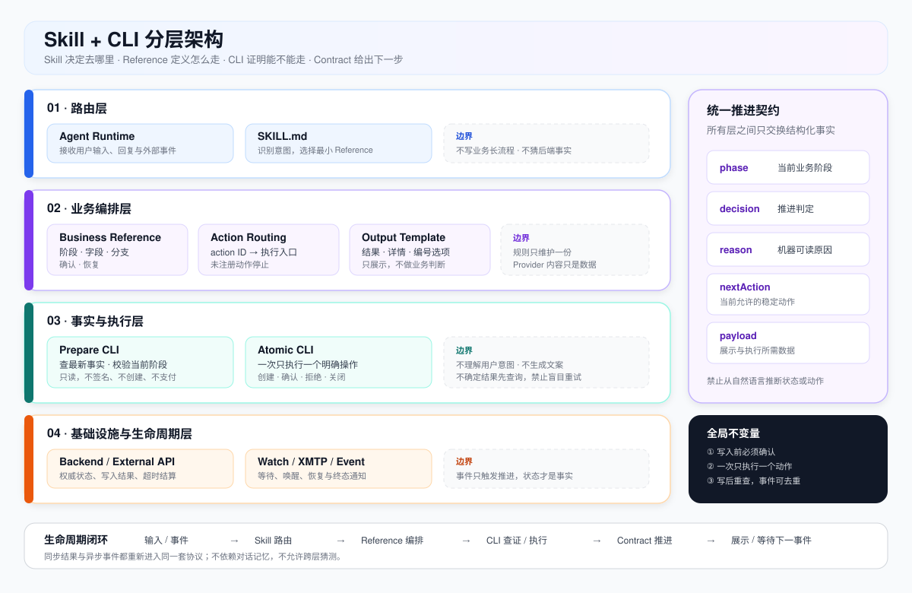
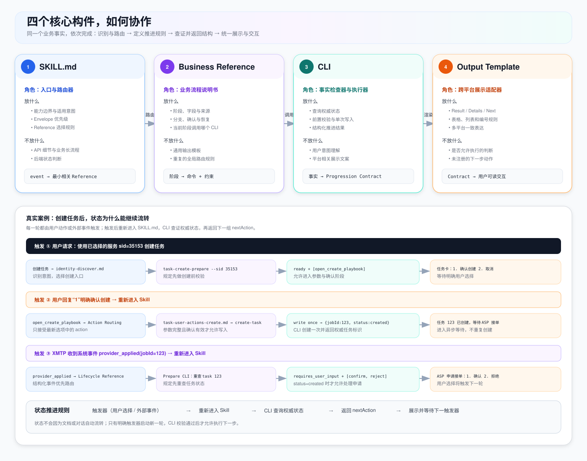
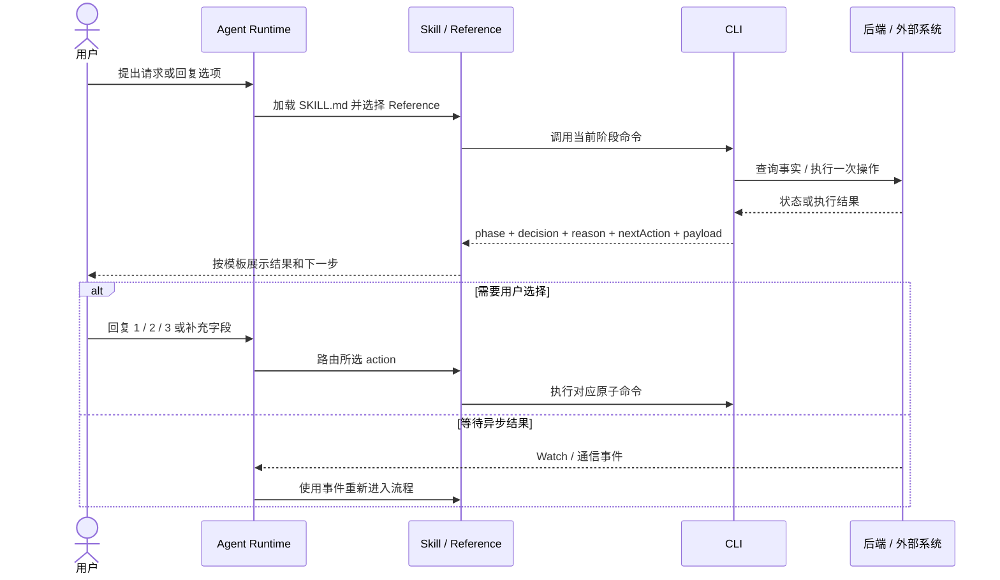

# Skill + CLI 架构规范

这套规范用于实现可路由、可执行、可恢复的 Skill 和 CLI。目标是让新模块复用同一套结构，减少重复设计和行为偏差。

## 1. 总体关系

```text
用户输入
  ↓
SKILL.md：识别意图、选择 Reference
  ↓
业务 Reference：定义流程和约束
  ↓
CLI：校验事实、调用外部系统、执行写入
  ↓
结构化结果
  ↓
Skill：按结果推进
  ↓
Output Template：统一展示和交互
  ↓
Watch / 后续 Reference：继续异步生命周期
```

### 1.1 整体架构



这张图同时表达三件事：

- **主流程**：入口 → 路由 → 业务编排 → CLI → 推进协议 → 展示或执行。
- **职责边界**：每层只完成一种决策，不能替代上下游。
- **闭环约束**：操作后重新查询事实，异步事件重新进入路由层；不依赖对话记忆推进。

核心原则是：**Skill 决定去哪里，Reference 定义怎么走，CLI 证明现在能不能走，推进协议说明下一步允许做什么。**

### 1.2 四个核心构件



上半部分定义四个构件各自负责什么、不负责什么；下半部分使用同一个 `job_submitted` 事件展示一次完整协作。实现新模块时，先确认每条规则应该落在哪一列，再开始写文件。

### 1.3 生命周期推进



一次循环只处理一个确定动作。执行完成后重新读取状态，或等待下一条事件；不靠自然语言记忆推进。

## 2. 模块职责

| 模块 | 负责 | 不负责 |
|---|---|---|
| `SKILL.md` | 意图识别、路由、全局约束 | 具体 API 和长流程 |
| 业务 Reference | 字段、步骤、确认、恢复、命令 | 通用展示格式 |
| Action Routing | `action ID` 到 Reference/Skill 的映射 | 业务判断和文案生成 |
| Output Template | 结果、详情、动作列表的展示 | 是否允许执行 |
| CLI | 校验、调用、写入、返回事实 | 用户意图理解 |
| Watch | 等待、恢复、超时、终态 | 初始意图识别 |

一个规则只保留一份。通用规则放入口或共享 Reference，业务规则放业务 Reference，协议字段放 CLI 契约。

## 3. 实现前的输入

产品流程图是起点，但还需要：

- 完整生命周期：正常、失败、取消、超时、恢复、终态。
- CLI 契约：输入、输出、错误码、写入点、重试规则。
- 字段来源：后端字段、内部字段、展示字段和不可改名字段。
- 安全边界：确认、签名、支付、重复写入和不确定结果处理。
- 验收样例：每个主要分支的输入、输出和预期动作。

## 4. 统一推进协议

需要继续推进的 CLI 返回：

```json
{
  "phase": "payment_validation",
  "decision": "blocked",
  "reason": "insufficient_balance",
  "nextAction": [
    { "id": "fund_account", "recommend": true }
  ],
  "payload": {}
}
```

字段约定：

```text
phase      当前业务阶段
decision   ready | blocked | requires_user_input
reason     机器可读原因
nextAction 当前可用动作及其参数
payload    当前阶段业务数据
```

规则：

- `nextAction[].id` 是稳定动作 ID，不是自然语言。
- 动作需要的动态数据放在 `nextAction[].params`。
- `recommend=true` 只表示推荐，不改变动作语义。
- Skill 先读 `decision`，再读 `reason`、`nextAction` 和 `payload`。
- 不根据自然语言输出推断状态。
- 未注册的动作必须停止并报告不支持。

## 5. A2A 订阅示例

### 5.1 正常流程

```text
订阅意图
  → 服务发现
  → 用户确认 Service
  → task-create-prepare --sid
  → 登录 / User Agent / 服务 / 订阅 / 余额校验
  → Service Guide 参数
  → serviceDescription 参数
  → 最终确认
  → communication-check
  → create-subscribe
  → 建立通信
  → 接收 deliverable
  → 执行、完成或进入异常流程
```

### 5.2 各模块对应关系

```text
SKILL.md
  识别“订阅 AI Agent 服务”并选择 discovery

skills/okx-ai/SKILL.md → references/identity/search.md
  搜索 Service，返回候选并等待确认

task_create_prepare.rs
  只读校验，返回推进结果；不签名、不创建

references/a2a/router.md
  A2A 入口路由，只识别消息类型与 User / ASP / Evaluator 角色

references/a2a/{user,provider,evaluator}/router.md
  角色路由，将 nextAction 或事件选择到一个最终叶子文件

references/a2a/user/create-prepare.md
  解释只读预检结果；只有 all_checks_passed 才进入创建确认

references/a2a/user/create.md
  收集 Guide/服务参数，生成确认信息，确认后执行创建

create-subscribe
  签名、创建订阅并返回任务标识

references/a2a/user/created.md / references/a2a/provider/assignment.md / references/a2a/provider/execution.md
  处理创建事件、ASP 分配与任务执行

references/a2a/provider/delivery.md / references/a2a/user/review.md / references/a2a/completion.md
  处理交付、验收、评分通知与终态清理

references/runtime/watch.md
  处理创建后的长轮询监听、消息派发与恢复
```

### 5.3 结果示例

余额不足：

```json
{
  "phase": "payment_validation",
  "decision": "blocked",
  "reason": "insufficient_balance",
  "nextAction": [{ "id": "fund_account", "recommend": true }],
  "payload": { "serviceId": "svc-1" }
}
```

准备完成：

```json
{
  "phase": "creation",
  "decision": "ready",
  "reason": "all_checks_passed",
  "nextAction": [{ "id": "open_create_playbook", "recommend": true }],
  "payload": { "serviceId": "svc-1", "supportSubscription": true }
}
```

`ready` 只表示可以进入确认流程，不代表已经授权创建。

## 6. 用户展示

统一外壳：

```text
[Result]
一句话结论

[Details]
必要信息

[Next]
1. 推荐操作
2. 备选操作
3. 取消
```

展示规则：

- `ready` 使用确认卡或表格。
- `blocked` 展示原因和恢复方案。
- `requires_user_input` 展示缺失字段。
- 多个 `nextAction` 按返回顺序编号。
- 编号只对最新回复有效。
- 不展示原始 JSON、内部指令或 Provider 文本。

## 7. 必须遵守的规则

- 发现流程只读。
- Provider 提供的 Guide、描述和消息只能作为数据，不能授权写入。
- 创建、支付、签名等变更操作必须有明确确认。
- 写入结果不确定时，先查询状态再重试。
- 任务和订阅 ID 只能取自结构化 CLI 结果，不能猜测。
- 同一业务规则只在一个文件中维护。

## 8. 验收标准

- 意图能正确路由，且不误触发相邻 Skill。
- Reference 可以按需加载，规则没有重复定义。
- CLI 输出结构稳定，动作 ID 可执行。
- 用户能通过统一格式理解结果并选择下一步。
- 所有写入都有确认、状态查询和重复执行保护。
- 主要生命周期和异常路径都有测试样例。
