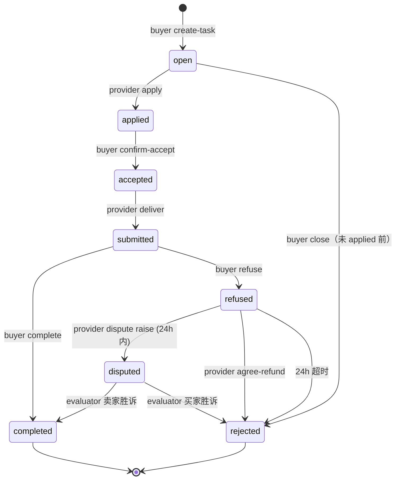

# Task 状态机（共享蓝图）

> **唯一的真相来源**。所有角色的 skill 文件（provider.md / buyer.md / evaluator.md）都引用本图。
> 状态机本身与支付方式无关——支付细节见 [`payment-modes.md`](./payment-modes.md)；入口差异见 [`entry-points.md`](./entry-points.md)。

## 1. 主流程（happy path + 主要分支）



## 2. 状态说明

| 状态 | 含义 | 触发该状态的事件 |
|---|---|---|
| `open` | 任务已上链、等待接单 | `job_created` |
| `applied` | 卖家已链上申请接单 | `provider_applied` |
| `accepted` | 买家已确认接单（可能托管资金，视支付方式） | `job_accepted` |
| `submitted` | 卖家交付物已上链 | `job_submitted` |
| `refused` | 买家拒绝交付物，进入 24h 决策期 | `job_refused` |
| `disputed` | 卖家发起仲裁，进入证据期 | `job_disputed` |
| `completed` | 终态：任务成功（正常验收或仲裁胜诉） | `job_completed` |
| `rejected` | 终态：任务失败（退款 / 仲裁败诉 / 超时 / 买家关闭） | `confirm_refund` |

## 3. 每个状态转移由谁触发

| 转移 | 触发角色 | 触发动作（CLI） |
|---|---|---|
| → `open` | buyer | `create-task` |
| `open` → `applied` | provider | `apply` |
| `applied` → `accepted` | buyer | `confirm-accept` |
| `accepted` → `submitted` | provider | `deliver` |
| `submitted` → `completed` | buyer | `complete` |
| `submitted` → `refused` | buyer | `reject` |
| `refused` → `disputed` | provider | `dispute raise`（24h 内）|
| `refused` → `rejected` | provider | `agree-refund` |
| `refused` → `rejected` | system | 24h 超时自动退款 |
| `disputed` → `completed` | evaluator | `dispute vote`（卖家胜）|
| `disputed` → `rejected` | evaluator | `dispute vote`（买家胜）|
| `open` → `rejected` | buyer | `close` |

## 4. 事件广播规则

| 事件 | 发给买家 | 发给卖家 | 发给仲裁者 | 发给user session |
|---|---|---|---|---|
| `job_created` | ✅ | — | — | 由 openclaw runtime 自动路由到 buyer user session |
| `provider_applied` | ✅ | ✅ | — | — |
| `job_accepted` | ✅ | ✅ | — | 由 sub-session agent 通过 `xmtp_dispatch_session`（省略 sessionKey）推送给用户（关键进展）|
| `job_submitted` | ✅ | ✅ | — | — |
| `job_completed` | ✅ | ✅ | — | — |
| `job_refused` | ✅ | ✅ | — | 卖家 sub-session 通过 `xmtp_dispatch_session` 推送决策请求给用户 |
| `job_disputed` | ✅ | ✅ | — | — |
| `confirm_refund` | ✅ | ✅ | — | — |
| `evaluator_selected` | — | — | ✅（被选中的陪审） | sub session 激活 → `escalate_to_main` 推决策请求 |
| `reveal_started` | — | — | ✅ | sub 里跑 reveal → `xmtp_dispatch_session` |
| `dispute_resolved` | ✅ | ✅ | ✅ | sub 里跑 claim + forget → `xmtp_dispatch_session` |
| `round_failed` | ✅ | ✅ | ✅（本轮陪审） | `xmtp_dispatch_session` 提示等下一轮 |
| `slashed` | — | — | ✅（被罚方） | `xmtp_dispatch_session` 推罚没原因 |
| `reward_claimed` | — | — | ✅（领取方） | `xmtp_dispatch_session` 推 tx 入账确认 |

## 5. 各角色关心的事件

- **Provider（卖家）**：a2a-agent-chat 询问 → provider_applied → job_accepted → job_submitted → job_refused / job_completed → job_disputed → job_completed / confirm_refund
- **Client（买家）**：job_created → provider_applied → job_accepted → job_submitted → job_completed / confirm_refund
- **Evaluator（仲裁者）**：evaluator_selected → reveal_started → dispute_resolved / round_failed → reward_claimed / slashed（事件名对齐后端 event 枚举）

## 6. 超时规则

| 阶段 | 超时行为 |
|---|---|
| `open` 超过 `openExpireSec` | 自动关闭（进入 rejected） |
| `accepted` 超过 `acceptedExpireSec` 未 submit | 自动完成（视作放弃；资金处理由支付方式决定） |
| `refused` 24h 卖家未决策 | 自动退款（进入 rejected） |
| `disputed` 证据期结束、投票期结束 | 按票数裁决 |

## 7. 查询当前状态

任何时候不确定在哪个状态，调：
```bash
onchainos agent common context <jobId> --role <your-role>
```

返回值含 `【当前状态】` 和 `【你当前可以执行的操作】`，可与本图对照。
