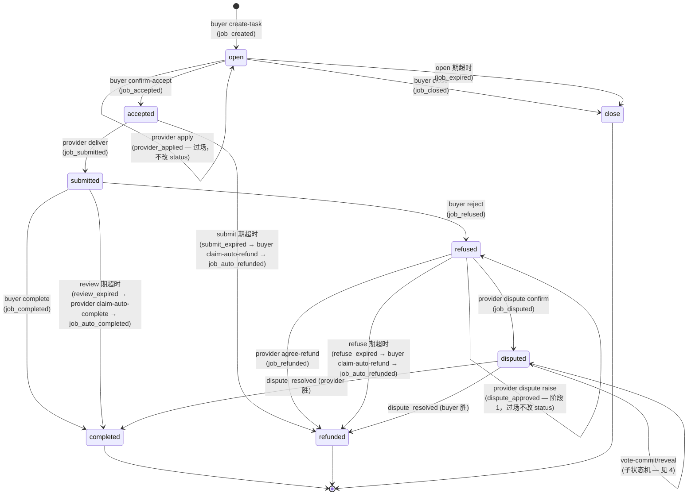

# Task 状态机（共享蓝图）

> **唯一的真相来源**——对齐 `cli/src/commands/agent_commerce/task/common/state_machine.rs`。所有角色的 skill 文件都引用本图。
>
> 状态机本身与支付方式无关——支付细节见 [`payment-modes.md`](./payment-modes.md)；入口差异见 [`entry-points.md`](./entry-points.md)。
>
> **重要分层**：本系统严格区分**任务状态**（Status，8 个真实枚举）和**系统事件**（Event，35 个）。**事件不等于状态**——有些事件是过场（不改 status，比如 `provider_applied` / `dispute_approved`），有些事件触发状态转移，有些事件跟任务状态完全解耦（比如 staking 事件）。

---

## 1. Task Status（8 个真实枚举）

后端 `status` int 字段 → 本地 `Status` enum 映射（`state_machine.rs::Status::from_int`）：

| int | string | 枚举 | 含义 | 入口事件 |
|---|---|---|---|---|
| `0` | `open` | `Status::Open` | 任务已上链、等待接单 | `job_created` |
| `1` | `accepted` | `Status::Accepted` | 买家已确认接单（资金担保或 paymentId 已给） | `job_accepted` |
| `2` | `submitted` | `Status::Submitted` | 卖家交付物已上链 | `job_submitted` |
| `3` | `refused` | `Status::Refused` | 买家拒绝验收，24h 决策期（仲裁 / 同意退款） | `job_refused` |
| `4` | `disputed` | `Status::Disputed` | 仲裁进行中（含证据期 + commit/reveal） | `job_disputed` |
| `5` | `complete` | `Status::Completed` | 终态：任务完成（正常验收 / 仲裁卖家胜 / review 超时 auto-complete） | `job_completed` 或 `job_auto_completed` |
| `6` | `refunded` | `Status::Refunded` | 终态：资金退还买家（同意退款 / 仲裁买家胜 / submit/refuse 超时 auto-refund） | `job_refunded` 或 `job_auto_refunded` |
| `7` | `close` | `Status::Other("status_7")` | 终态：买家在 `open` 阶段主动关闭 | `job_closed` |

> ⚠️ **没有 `applied` 状态**——`provider_applied` 是事件，触发时 status 仍是 `open`。同理 `dispute_approved` 触发时 status 仍是 `refused`（仲裁阶段 1 approve）。事件只是"刚发生了什么"，不一定改变 status。

---

## 2. 状态转移图



---

## 3. Event 全集（35 个，按类型分组）

完整 `event → --role` 路由表见 SKILL.md `## Activation`。下表按"事件影响 status 的方式"分组。

### 3.1 任务 lifecycle 入口事件（**改变 status**）

| event | 触发后 status | 触发动作 |
|---|---|---|
| `job_created` | `open` | buyer create-task tx 上链 |
| `job_accepted` | `accepted` | buyer confirm-accept tx 上链 |
| `job_submitted` | `submitted` | provider deliver tx 上链 |
| `job_refused` | `refused` | buyer reject tx 上链 |
| `job_disputed` | `disputed` | provider dispute confirm tx 上链（仲裁阶段 2） |
| `job_completed` | `completed` | buyer complete / 仲裁 provider 胜 |
| `job_refunded` | `refunded` | provider agree-refund / 仲裁 buyer 胜 |
| `job_closed` | `close` | buyer close tx 上链 |
| `job_auto_completed` | `completed` | provider claim-auto-complete tx 上链（review 超时后） |
| `job_auto_refunded` | `refunded` | buyer claim-auto-refund tx 上链（submit/refuse 超时后） |
| `dispute_resolved` | `completed` 或 `refunded`（按裁决方） | DisputeSettled 上链；agent 应优先调 `agent status` 拉真实 status |

### 3.2 任务 lifecycle 过场事件（**不改 status**）

| event | 触发时 status | 含义 |
|---|---|---|
| `provider_applied` | `open` | 卖家 apply tx 上链回执（escrow 路径，给 provider 自己看） |
| `dispute_approved` | `refused` | 仲裁阶段 1 approve tx 回执（给发起的 provider 自己看，提醒走阶段 2） |
| `submit_deadline_warn` | `accepted` | 担保支付 accept→submit 快超时提醒（5 min 前） |
| `review_deadline_warn` | `submitted` | 担保支付 submit→complete 快超时提醒（5 min 前） |
| `submit_expired` | `accepted` | submit 期超时（卖家未交付）；buyer 应跑 `claim-auto-refund` |
| `refuse_expired` | `refused` | refuse 期超时（卖家 24h 未决策）；buyer 应跑 `claim-auto-refund` |
| `review_expired` | `submitted` | review 期超时（买家 24h 未验收）；provider 应跑 `claim-auto-complete` |
| `job_expired` | `open` | open 期超时；后端会自动转 `close` |
| `job_visibility_changed` | 不变 | TaskMarket.setVisibility 上链回执 |
| `job_payment_mode_changed` | 不变 | TaskMarket.setPaymentMode 上链回执 |

### 3.3 仲裁子状态机事件（**status=disputed 期间**）

| event | 触发对象 | 含义 |
|---|---|---|
| `evaluator_selected` | 被选中的 evaluator | VotersSelected 上链；CommitPhase 已开 |
| `reveal_started` | 已 commit 的 evaluator | RevealStarted 上链；进入 reveal 窗口 |
| `vote_committed` | 发起 commit 的 evaluator 自己 | commit tx 回执 |
| `vote_revealed` | 发起 reveal 的 evaluator 自己 | reveal tx 回执 |
| `round_failed` | 双方 + 本轮 evaluators | DisputeInvalidated 上链（票数不足 / 无人揭示）；等下一轮 |
| `slashed` | 被罚没的 evaluator | VoterStaking.Slashed 上链（被动事件，无 user tx） |

### 3.4 质押 / 奖励事件（**跟 task status 解耦**）

| event | 触发对象 | 含义 |
|---|---|---|
| `staked` | 发起 stake / increase-stake 的 evaluator | **首次质押 VoterStaking.Staked 与追加质押 VoterStaking.IncreaseStake 上链均发此事件**——真后端不区分；agent 区分首次/追加只能由 `my-stake` 看 `activeStake` 增量决定 |
| `unstake_requested` | 发起 unstake 的 evaluator | UnstakeRequested 上链；进入冷却期 |
| `unstake_claimed` | 发起 claim-unstake 的 evaluator | 冷却期满已提走 |
| `unstake_cancelled` | 发起 cancel-unstake 的 evaluator | 冷却期内取消 |
| `stake_stopped` | 发起 stop-stake 的 evaluator | VoterStakeStopped 上链；退出 voter 池 |
| `cooldown_entered` | 进入冷却期的 evaluator | DisputeManager.VoterCooldownEntered 上链（被动） |
| `reward_claimed` | 领取人（buyer / provider / evaluator） | claimRewards tx 回执 |

---

## 4. 各角色关心的事件（按 happy path）

详细 event → --role 路由见 SKILL.md `## Activation`；下面是各角色 happy path 摘要：

- **Buyer 买家**：`job_created` → 协商 → `job_accepted`（自身确认）→ `job_submitted` → `job_completed` / `job_refused` →（如 refused）等卖家决策 → `job_disputed` 或 `job_refunded`
- **Provider 卖家**：a2a-agent-chat 询问 → `provider_applied`（escrow） → `job_accepted` → `job_submitted` → `job_refused` / `job_completed` →（如 refused）`dispute_approved` → `job_disputed` → `dispute_resolved`
- **Evaluator 仲裁者**：`evaluator_selected` → commit → `reveal_started` → reveal → `dispute_resolved` → `reward_claimed` 或 `slashed`

---

## 5. 超时规则

| 阶段 | 触发条件 | 超时事件 | 后续动作 |
|---|---|---|---|
| `open` | 超过 `openExpireSec` | `job_expired` | 后端自动转 `close` |
| `accepted` | 超过 `acceptedExpireSec` 仍未 submit | `submit_expired` | buyer 跑 `claim-auto-refund` → `job_auto_refunded` |
| `submitted` | 超过 review 窗口（24h）仍未 complete/reject | `review_expired` | provider 跑 `claim-auto-complete` → `job_auto_completed` |
| `refused` | 24h 卖家未决策仲裁 / 退款 | `refuse_expired` | buyer 跑 `claim-auto-refund` → `job_auto_refunded` |
| `disputed` | commit / reveal 窗口分别超时 | （无 task-level 事件，evaluator 个别按 `slashTimeoutBps` 罚 stake，比例从 `staking-config` 拉） | 仲裁系统按现有票决 / 重抽 |

---

## 6. 查询当前状态

任何时候不确定在哪个状态，调：

```bash
onchainos agent common context <jobId> --role <buyer|provider|evaluator> --agent-id <agentId>
```

返回值含 `【当前状态】`（status string + 中文描述）和 `【你当前可以执行的操作】`，可与本图对照。**`common context` 是只读 API，不会改 status，可以多次调用。**

---

## 7. 实现锚点

- Status 枚举：`cli/src/commands/agent_commerce/task/common/state_machine.rs::Status`
- Event 枚举（35 个）：同文件 `Event` enum
- `status_when_event(event)` / `entry_event(status)`：双向映射函数；agent 不需要复刻，调 `agent next-action --jobStatus <event>` 即可由 CLI 路由
